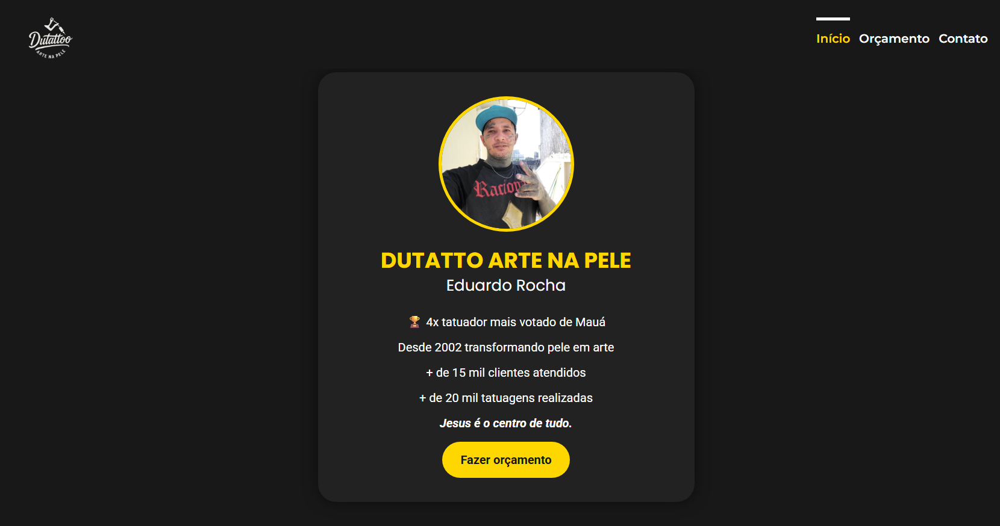
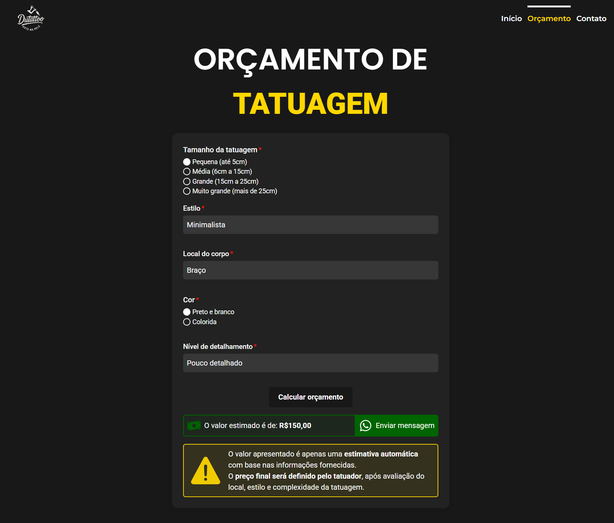
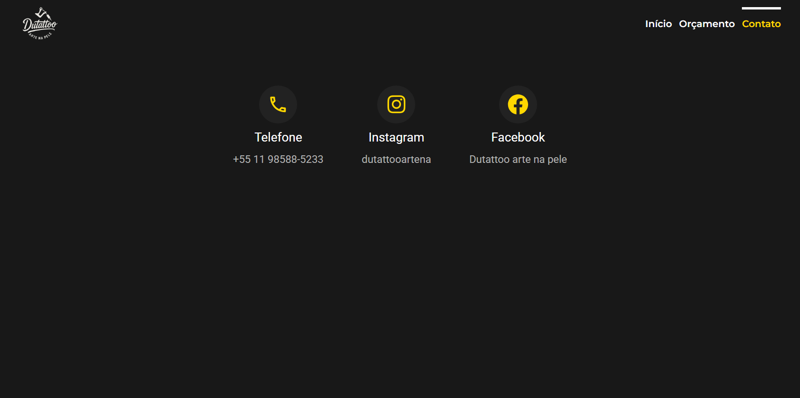

# <h1 align="center">DUTATTOO</h1>

A web application designed to simplify the tattoo quote process quickly and easily. With an interactive form, users can simulate a tattoo quote and contact the tattoo artist directly via WhatsApp. Built with React.js and CSS Modules, with no user authentication or database.

## 📸 Application Interface

  
  


## 📋 Table of Contents

- [About the Project](#about-the-project)
- [Features](#features)
- [Technologies Used](#technologies-used)
- [Getting Started](#getting-started)
- [Page Structure](#page-structure)

---

## <h2 id="about-the-project">🧾 About the Project</h2>

**Dutattoo** is a web app that streamlines the process of getting a tattoo quote. The user fills out a form with the desired tattoo details and can send a personalized message directly to the tattoo artist via WhatsApp. The app also displays the artist’s contact information and an introductory section.

---

## <h2 id="features">✨ Features</h2>

- Homepage with information about the tattoo artist  
- Interactive quote form  
- Automatic WhatsApp message generation  
- Contact page with available communication channels  

---

## <h2 id="technologies-used">🛠 Technologies Used</h2>

- **React.js**  
- **react-router-dom**  
- **react-icons**  
- **CSS Modules**

---

## <h2 id="getting-started">🚀 Getting Started</h2>

1. Clone the repository:
   ```bash
   git clone https://github.com/vinimpds11/dutattoo.git
   cd dutattoo
   ```

2. Install the dependencies:
   ```bash
   npm install
   ```

3. Start the application:
   ```bash
   npm run dev
   ```

The app will be available at: `http://localhost:5173`

---

## <h2 id="page-structure">🗂 Page Structure</h2>

### 🏠 Home

Displays an overview of the tattoo artist, including experience, work style, and philosophy. Great for building trust with site visitors.

### 💰 Quote

A form where users can fill in the following options:

- **Tattoo size**  
- **Body location**  
- **Tattoo style**  
- **Color or black and gray**  
- **Detail level**

After completing the form, a **personalized message** is generated and the user is redirected to the tattoo artist's WhatsApp with all the selected details included.

### 📞 Contact

Displays the available contact channels for users to reach out to the tattoo artist (email, social media, phone, etc.).

---

## <h2 id="author">👤 Author</h2>

Made by [ViniMPDS11](https://github.com/ViniMPDS11).

---

## <h2 id="license">📄 License</h2>

This project is licensed under the **MIT License**.  
You are free to use, copy, modify, and distribute this project for personal or commercial purposes, as long as you include the original copyright.
